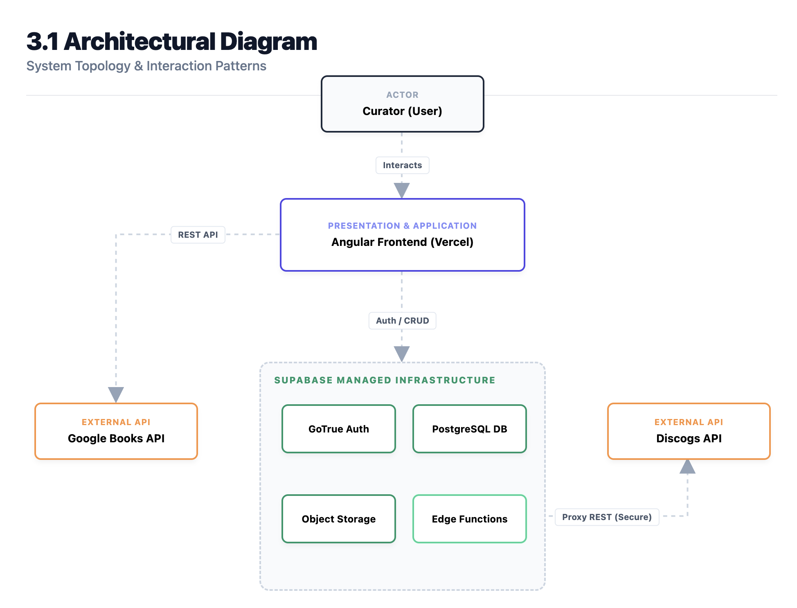
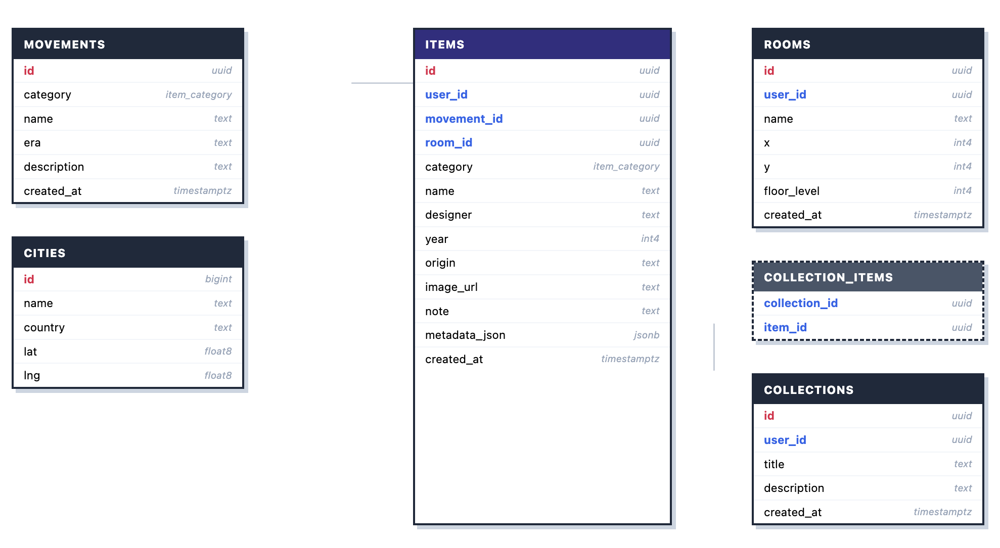
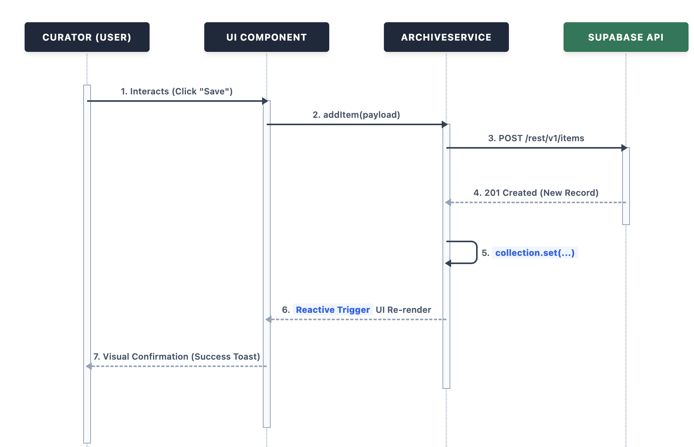

# Architectural Design Document: Archival

## 1. Introduction

### 1.1 Purpose

This document provides a high-level overview of the architectural design for the Archival project. It focuses on system-wide structural decisions, patterns, and component interactions.

### 1.2 System Overview

Archival is a curation platform for intentional collectors. It allows users to document physical objects (furniture, fashion, literature, music) and link them to genres and historical design movements. The system provides high-fidelity visualizations, including a "Museum View" gallery, a historical timeline, and spatial mapping.

## 2. Architectural Goals and Constraints

### 2.1 Goals

- **Minimalist Aesthetics:** Deliver a "Museum View" using high-contrast monochrome design and grid-based layouts.
- **Data Enrichment:** Automate metadata retrieval via external APIs (Google Books, Discogs).
- **High Performance:** Maintain sub-2-second load times and real-time filtering (300ms).
- **Scalability:** Leverage Backend-as-a-Service (BaaS) to handle growing collection sizes without local infrastructure.

### 2.2 Constraints

- **BaaS Dependency:** The system relies on Supabase for database, authentication, and storage.
- **API Rate Limits:** External metadata discovery is bound by Google and Discogs API quotas.
- **Single-User Scope:** Data isolation must be strictly enforced via Row Level Security (RLS).

## 3. High-Level Architecture

The Archival system follows a **Two-Tier Backend-as-a-Service (BaaS)** pattern. The client-side application handles all business logic and orchestration, communicating directly with managed cloud services.

### 3.1 Architectural Diagram

### 3.2 Tiers

- **Presentation & Application Tier (Frontend):** An Angular-based Single Page Application (SPA) responsible for state management (Signals), UI rendering, and coordinating data flow.
- **Data & Service Tier (Backend):** Managed by Supabase, providing relational storage, identity management, and serverless compute (Edge Functions).

## 4. Component Architecture

The system is organized into several Computer Software Components (CSCs):

### 4.1 Acquisitions CSC

Handles the intake of new items. It orchestrates calls to external APIs for metadata enrichment and manages image uploads to cloud storage.

### 4.2 Gallery CSC

Manages the primary visualization grid. It implements complex client-side filtering and searching logic to provide a responsive "Museum View."

### 4.3 Chronology CSC

Processes temporal metadata to render items on a vertical timeline, allowing users to see the historical density of their collection.

### 4.4 Insights CSC

Aggregates collection data for analytical visualizations. It utilizes ApexCharts for distribution data and Leaflet for geographical provenance mapping.

### 4.5 Blueprint CSC

Provides a spatial dimension to the collection by mapping items to virtual rooms using a custom CSS grid-based floor plan.

### 4.6 Core Services

- **ArchiveService:** The central hub for state management, database CRUD operations, and authentication synchronization using Angular Signals.

## 5. Data Design

### 5.1 Persistence

Data is stored in a relational PostgreSQL database managed by Supabase. The schema is designed to support polymorphic items (Books, Music, Decor, Fashion) through shared metadata fields and category-specific logic.

### 5.2 Storage

High-resolution archival photographs are stored in Supabase Object Storage. Files are organized in user-specific folders to ensure security and isolation.

### 5.3 State Management

The application utilizes **Angular Signals** for reactive state. This ensures that changes to the collection or user authentication state are propagated instantly across all views (Gallery, Insights, Chronology).

## 6. Security Architecture

### 6.1 Authentication

Identity is managed via Supabase Auth (GoTrue). Users authenticate via email/password, and the system issues JWTs for secure API communication.

### 6.2 Authorization (Row Level Security)

Data isolation is enforced at the database level using PostgreSQL **Row Level Security (RLS)**. Every query is automatically scoped to the authenticated user's ID (`auth.uid()`), preventing cross-user data access.

### 6.3 Credential Protection

Sensitive API keys (e.g., Discogs) are never exposed to the frontend. Instead, the frontend calls a Supabase Edge Function which acts as a secure proxy, injecting the required credentials server-side.

## 7. Technology Stack

- **Frontend Framework:** Angular 19+ (TypeScript)
- **Styling:** SCSS (Vanilla CSS Grid/Flexbox)
- **Backend-as-a-Service:** Supabase (PostgreSQL, Auth, Storage, Edge Functions)
- **Hosting:** Vercel (Frontend), Supabase (Backend)
- **Visualization Libraries:** ApexCharts (Charts), Leaflet (Maps)
- **APIs:** Google Books, Discogs
