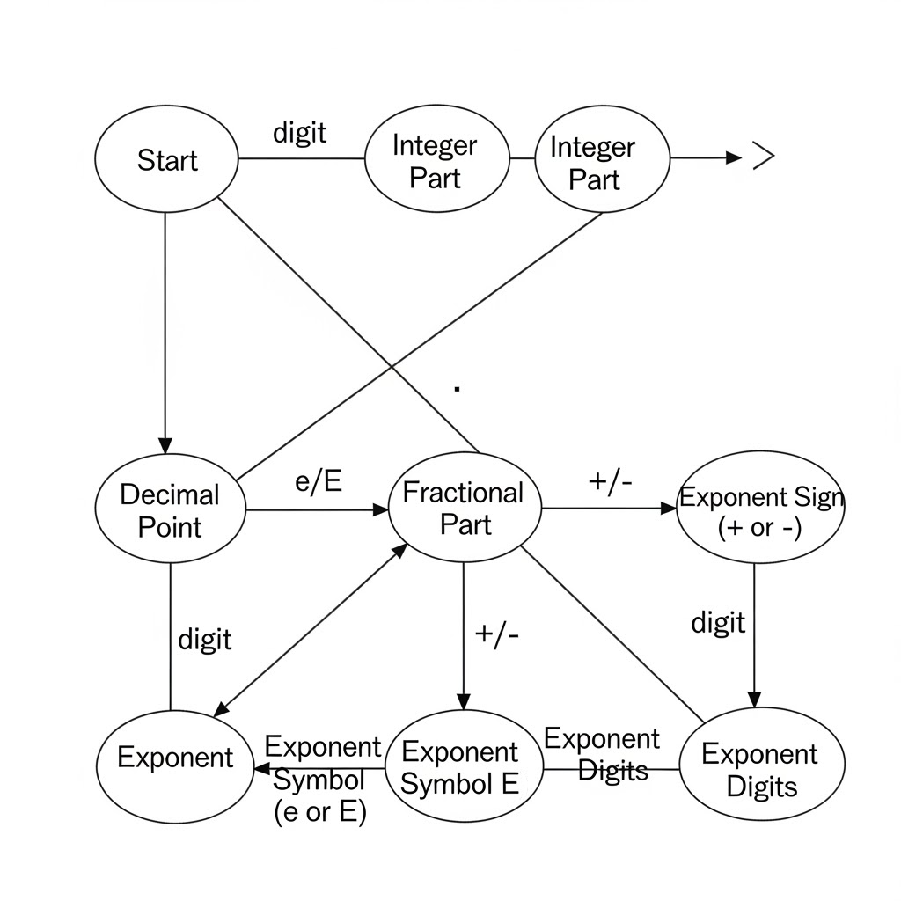
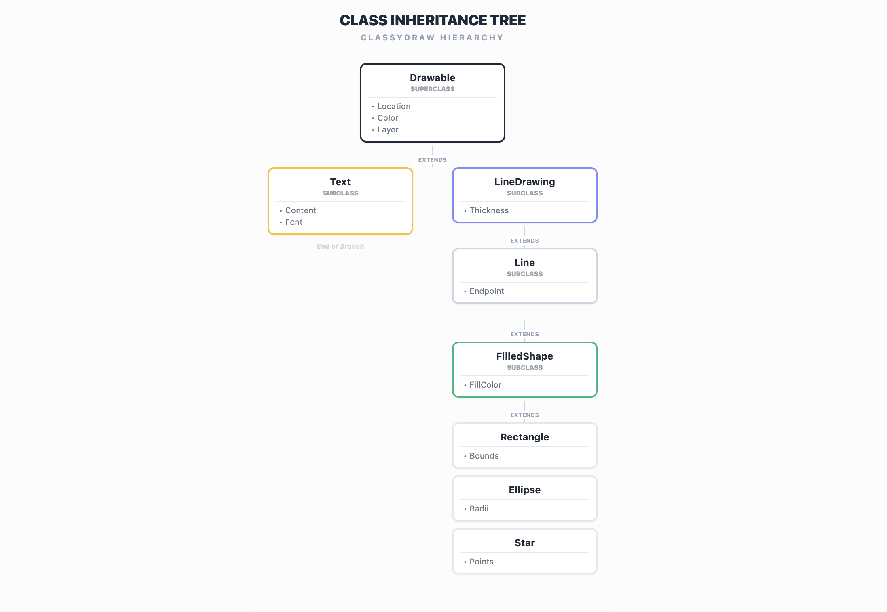

# Homework Assignment #2

### Problem 5.1, Stephens page 116

- What's the difference between a component-based architecture and a service-oriented architecture?

  A component based architecture is comprised of components that provide services for each other while a service-oriented one is made up of services. The pieces are more seperated in a service oriented architecturue and they often run on seperate compilers.

### Problem 5.2, Stephens page 116

- Suppose you're building a phone application that lets you play tic-tac-toe against a simple computer opponent. It will display high scores stored on the phone, not in an external database. Which architectures would be most appropriate and why?

  The most appropriate architectures would monolithic and data-centric as the application is relatively simple and could be implemented using a set of rules without too much complexity. There isn't need for client server or service oriented architectures because the application isn't very complicated and the high scores will be stored on the phone.

### Problem 5.4, Stephens page 116

- Repeat question 3 [after thinking about it; it repeats question 2 for a chess game] assuming the chess program lets two users play against each other over an Internet connection.

  If web services are used to allow the users to communicate over the internet the most appropriate architectures would be monolithic and data centric with the addition of service-oriented.

### Problem 5.6, Stephens page 116

- What kind of database structure and maintenance should the ClassyDraw application use?

  A document-centric appropriate that avoids a complicated database would be appropriate for ClassyDraw. Each drawing can be treated as an individual file on their OS. Then maintenance can be kept simple as the OS can handle operations like deleting and moving the ClassyDraw files.

### Problem 5.8, Stephens page 116

- Draw a state machine diagram to let a program read floating point numbers in scientific notation as in +37 or -12.3e+17 (which means -12.3 x 1017). Allow both E and e for the exponent symbol.
  
  

### Problem 6.1, Stephens page 138

- Consider the ClassyDraw classes Line, Rectangle, Ellipse, Star, and Text.
- What properties do these classes all share?
  Location, color, and layer order would be some shared properties.
  
- What properties do they NOT share?
  Text properties and properties specific to shapes like the number of points of a star wouldn't be shared.
  
- Are there any properties shared by some classes and not others?
  Fill color would be shared among shapes and line thickness would be shared amount class that draw lines but not text.
  
- Where should the shared and nonshared properties be implemented?
  The shared properties could be implemented in a base class and unique properties in subclassses.
  

### Problem 6.2, Stephens page 138

- Draw an inheritance diagram showing the properties you identified for Exercise 6.1.
  
  
