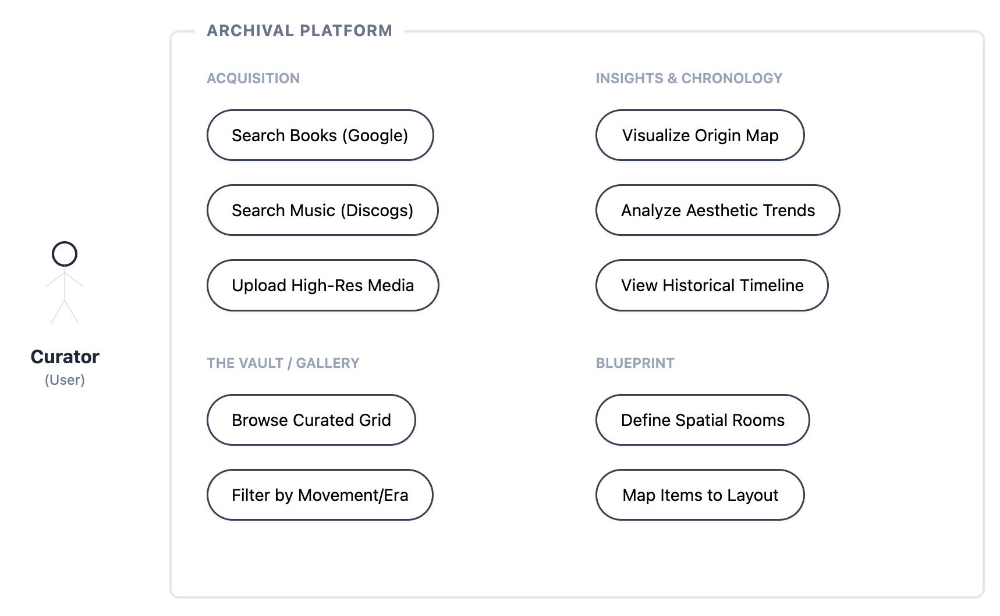
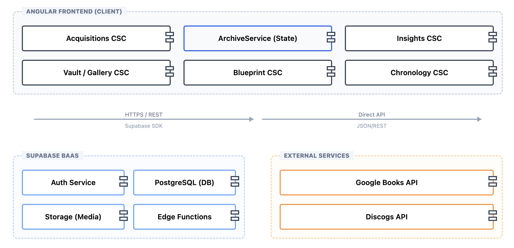
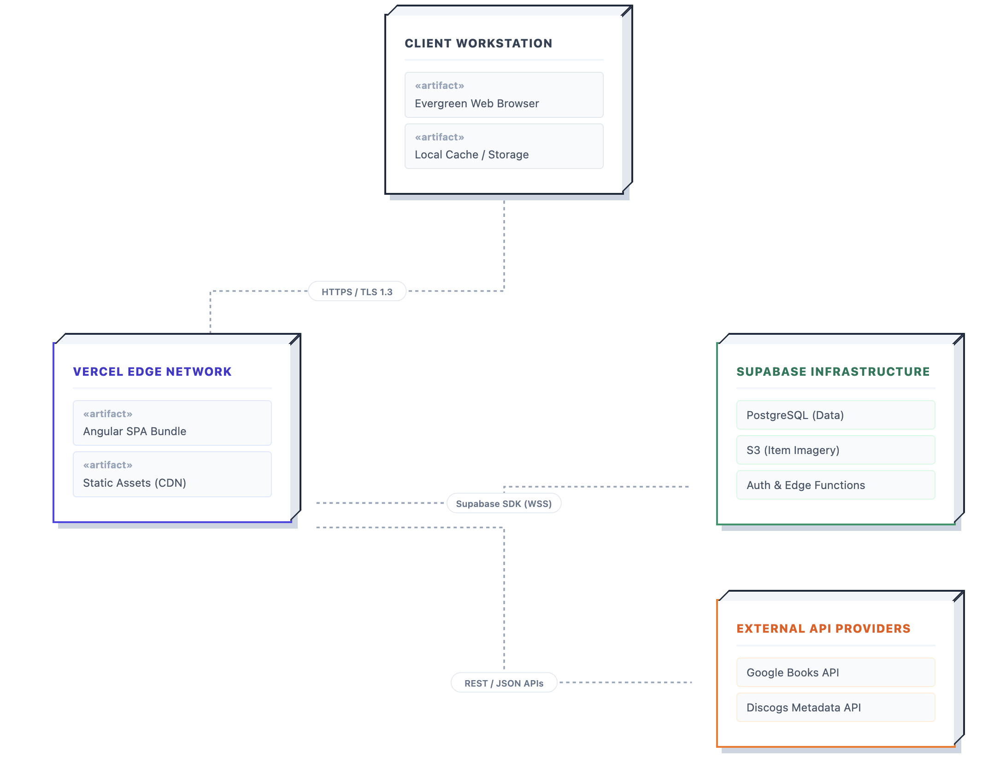

# Software Design Description (SDD): Archival

## 6.1 Introduction
This document presents the architecture and detailed design for the software for the Archival project. The project performs high-fidelity design curation by allowing users to store their items in a museum-like environment. This environment leverages external APIs for metadata enrichment and provides advanced visualizations through a digital gallery ("The Vault"), a historical timeline ("Chronology"), an analytics dashboard ("Insights"), and a spatial map ("Blueprint").

### 6.1.1 System Objectives Section
The objective of this application is to provide a sophisticated interface for personal collection management that mimics the experience of a digital museum. 
* **Automated Discovery:** Automate the "Acquisition" process by retrieving metadata and imagery from Google Books and Discogs.
* **Curation & Vaulting:** Provide a high-fidelity "Gallery" view to browse and filter curated items in a high-contrast grid.
* **Temporal Analysis:** Visualize the historical weight and evolution of a collection over time via an interactive timeline.
* **Data-Driven Insights:** Provide analytics into aesthetic preferences, identifying correlations between items and historical design movements.
* **Spatial Context:** Map items to physical locations using a virtual floor plan ("Blueprint") to provide a 2D topographical context.
* **System Resilience:** Ensure stable operation through offline-ready navigation and local persistence of partial saves.

### 6.1.2 Hardware, Software, and Human Interfaces Section

#### 6.1.2.1 Hardware Interfaces
1. **Workstations & Mobile Devices:** The system is a web-based platform designed for modern desktop and mobile hardware capable of running evergreen browsers.
2. **Input Peripherals:** Standard interface support for Keyboard (data entry), Mouse/Trackpad (navigation and spatial mapping), and Touchscreens (mobile interactions).
3. **Display:** Recommended minimum resolution of 1024x768 to accommodate data-dense visualizations and the wide-grid "Museum View."
4. **Networking:** Requires an active internet connection for real-time Supabase synchronization, though the system implements an offline "Read-Only" mode for local browsing.

#### 6.1.2.2 Software Interfaces
1. **Supabase Client (v2.93.2):** The primary interface for PostgreSQL data management, Auth (JWT-based), and Object Storage.
2. **Angular Framework (v19.2.0):** The core client-side engine using Signals for reactive state management.
3. **Google Books API:** RESTful interface for retrieving literary metadata directly from the client.
4. **Discogs API:** Metadata source for music records, accessed via a server-side Supabase Edge Function to protect credentials.
5. **ApexCharts (v5.6.0):** Used for rendering data distribution and temporal intensity graphs.
6. **Leaflet (v1.9.4):** Open-source mapping library used for the global provenance visualization.
7. **Web Storage API (localStorage):** Used for client-side persistence of the Acquisition form to prevent data loss.

#### 6.1.2.3 Human Interfaces
1. **Graphical User Interface (GUI):** A "Museum Minimalist" interface utilizing high-contrast monochrome palettes, wide grid spacing, and geometric typography.
2. **Acquisition Form:** A polymorphic data-entry interface that adapts fields based on the item category.
3. **The Vault:** A grid-based discovery interface with real-time, multi-dimensional filtering.
4. **Interactive Map:** A zoomable world map used to explore the geographical clusters of the collection.

---

## 6.2 Architectural Design Section
The architectural design for Archival is based on a Two-Tier Backend-as-a-Service (BaaS) pattern, connecting a rich Angular frontend directly to a managed Supabase backend.

### 6.2.1 Major Software Components Section
1. **Acquisitions CSC:** (FR 1, 2, 3, 4). Handles automated metadata discovery, polymorphic form logic, metadata refinement, and 5MB archival photograph uploads.
2. **Vault/Gallery CSC:** (FR 5, 6, 7). Manages the high-fidelity archival grid, multi-dimensional filtering, and real-time internal search.
3. **Chronology CSC:** (FR 8, 9). Processes temporal data to render vertical timeline visualizations.
4. **Insights CSC:** (FR 10, 11, 12). Performs analytical data aggregation for style correlation charts, temporal intensity, and the global provenance map.
5. **Curation/Collections CSC:** (FR 13, 14). Manages thematic collections, spatial assignments, and relational discovery.
6. **Blueprint CSC:** (FR 15, 16). Manages spatial mapping and virtual room topography.
7. **Identity CSC:** (FR 17). Manages secure user authentication and programmatic data isolation.

### 6.2.2 Major Software Interactions Section
The Angular frontend communicates with Supabase via the `supabase-js` client using HTTPS REST calls. Authentication state is tracked using a global `isOnline` signal and session signals. Data flow is unidirectional: components trigger service methods, which update centralized signals, triggering reactive UI updates across the entire application bundle.

### 6.2.3 Architectural Design Diagrams Section
1. **Use Case Diagram:** Defines interactions between the "Curator" and the core subsystems.

2. **Component Diagram:** Illustrates dependencies on Supabase and external REST APIs.

3. **Deployment Diagram:** Shows Vercel hosting and Supabase infrastructure connectivity.

---

## 6.3 CSC and CSU Descriptions Section

### 6.3.1 Detailed Class Descriptions
The following sections provide the details of all core classes used in the Archival application, ordered from support units to complex orchestrators.

#### 6.3.1.1 GalleryComponent (CSU)
Manages the primary visualization of the user's collection with advanced filtering capabilities.
* **Fields:**
    * `showFilters`: Signal (boolean) toggling the visibility of the filter drawer.
    * `searchQuery`: Signal (string) holding the current user-entered search term.
    * `activeFilters`: Signal (Record) tracking current category, origin, era, and movement selections.
* **Methods:**
    * `filteredItems()`: Computed signal applying search and metadata filters to the collection.
    * `filterOptions()`: Computed signal generating unique filter choices based on current data.
    * `onSearchChange(event)`: Updates the `searchQuery` signal with debounced input.

#### 6.3.1.2 BlueprintComponent (CSU)
Manages the 2D spatial context of the collection using a virtual floor plan.
* **Fields:**
    * `newRoomName`: Signal (string) for the room creation input field.
    * `hoveredRoomId`: Signal tracking the room currently under the user's cursor.
* **Methods:**
    * `gridSize()`: Computed signal defining the dynamic cells and dimensions of the CSS grid.
    * `addRoom()`: Triggers the global service to register a new spatial volume.
    * `getItemsInRoom(name)`: Filters the collection to return items assigned to a specific room.

#### 6.3.1.3 InsightsComponent (CSU)
Orchestrates analytical visualizations including provenance mapping and temporal intensity.
* **Fields:**
    * `hoveredMovement`: Signal tracking stylistic metadata for overlay descriptions.
    * `mapElement`: ElementRef targeting the Leaflet container in the DOM.
* **Methods:**
    * `originCounts()`: Computes distribution data for the ApexCharts pie chart.
    * `temporalData()`: Computes decade-specific paths for the intensity SVG.
    * `initMap()`: Asynchronous method to initialize the world map and plot provenance markers.

#### 6.3.1.4 AcquisitionComponent (CSU)
Manages the complex, polymorphic intake flow for new archival items.
* **Fields:**
    * `newItem`: Signal (Partial Item) holding the current draft state of the record.
    * `showDuplicateWarning`: Signal (boolean) controlling the redundancy confirmation modal.
    * `searchError`: Signal (string) providing fallback notifications for API failures.
    * `STORAGE_KEY`: Constant for `localStorage` persistence of partial saves.
* **Methods:**
    * `onNomenclatureChange(event)`: Debounced method triggering API discovery.
    * `selectBook(book)` / `selectDiscogsRelease(release)`: Maps external metadata to the internal item model.
    * `handleSubmit()`: Main submission logic with duplicate detection and error handling.
    * `confirmDuplicate()`: User confirmation method to bypass redundancy warnings.

#### 6.3.1.5 ArchiveService (CSU)
The central configuration item managing global state and backend synchronization.
* **Fields:**
    * `collection`: Signal holding the validated list of all archival items.
    * `isOnline`: Signal (boolean) tracking the browser's connectivity status.
    * `user`: Signal tracking the authenticated Supabase GoTrue session.
    * `movements` / `rooms` / `cities`: Metadata signals for discovery and mapping.
* **Methods:**
    * `fetchUserData(userId)`: Central data fetcher with offline protection and relational mapping.
    * `addItem(item)` / `updateItem(id, updates)`: Methods for persisting records to Supabase.
    * `uploadImage(file)`: Service for processing and storing 5MB archival photographs.
    * `initOnlineStatus()`: Sets up event listeners for browser connectivity changes.

### 6.3.2 Detailed Interface Descriptions
Subsystems transmit data via standardized JSON objects mapped to the following TypeScript interfaces:
* **Subsystem Handoff:** Components transmit "Partial" records to the `ArchiveService`, which validates and augments them with user-specific metadata before transmission to Supabase.
* **Control Flow:** Interaction signals (e.g., `isSubmitting`) are used to lock UI elements across different CSCs during asynchronous handshakes with external APIs.

### 6.3.3 Detailed Data Structure Descriptions
* **Database Query Results:** Data is returned from Supabase as a `PostgrestResponse`, which is mapped into local item signals including `updated_at` and `roomId` for UI-friendly consumption.
* **localStorage State:** Partial saves are stored as serialized JSON strings indexed by `STORAGE_KEY`, ensuring form persistence without server-side overhead.

### 6.3.4 Detailed Design Diagrams Section

*(Note: Detailed Sequence Diagrams for the Acquisition and Search flows are included in the Technical Design Addendum.)*

---

## 6.4 Database Design and Description

### 6.4.1 Database Design ER Diagram

### 6.4.2 Database Access
Database access is managed via the Supabase PostgREST API using the `supabase-js` client. Authenticated queries are automatically scoped by the server to the user's `auth.uid()`, preventing cross-user data leakage.

### 6.4.3 Database Security
* **Row Level Security (RLS):** Enabled on all tables. Policies strictly enforce `user_id` ownership for all CRUD operations.
* **PostgreSQL Triggers:** An `update_updated_at` trigger is implemented on the `items` table to automate the audit trail required by FR 4.
* **Storage RLS:** Restricts photo access to the authenticated owner via folder-path verification.
