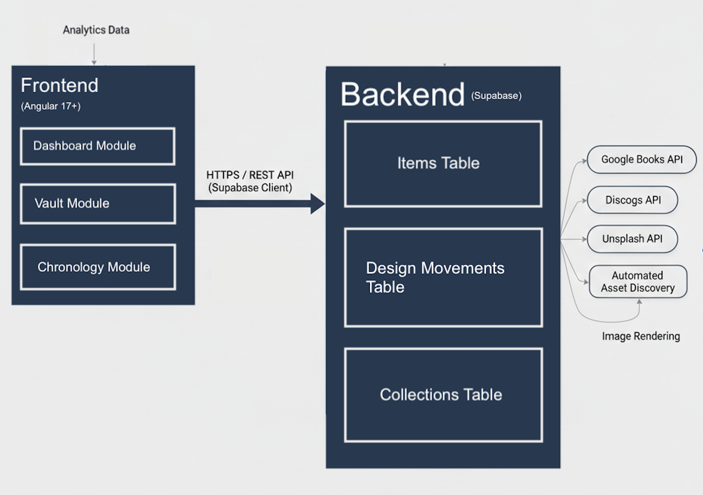

# 5. Software Requirements Specification: Archival

## 5.1 Requirements Introduction

### 5.1.1 Project Description
Archival is a specialized, full-stack curation platform engineered for design enthusiasts and intentional collectors who seek to move beyond simple inventory tracking toward a deep, analytical understanding of their personal belongings. By treating furniture, fashion, and literature as interconnected data points, the system allows users to document the "aesthetic DNA" of their home, linking physical objects to the historical design movements—such as Bauhaus, Mid-Century Modern, or Radical Design—that define them. The application utilizes an Angular-based "Museum View" to visualize the chronological density of a collection, leveraging a Node.js backend and a PostgreSQL relational database to identify the hidden common threads that unite disparate items into a cohesive personal archive. Through this sophisticated logic engine, users can analyze the historical evolution of their lifestyle and curate their environment with the rigor of a professional archivist.

The remainder of this document is structured as follows. Section 5.2 contains Functional Requirements describing the specific services and features provided by the system, such as polymorphic item registration and the style correlation engine. Section 5.3 contains Performance Requirements detailing the target metrics for interface responsiveness and complex SQL query execution. Section 5.4 details the Environment Requirements, specifying the hardware and software resources required for the development and execution of the application, including the Node.js runtime and PostgreSQL database.

### 5.1.2 UML Diagram

---

## 5.2 Functional Requirements

The completed Archival system will provide a comprehensive digital environment for design enthusiasts to curate, visualize, and analyze their personal collections. The system will allow users to register artifacts from diverse categories—including furniture, fashion, and literature—and link them to historical design movements. Users can expect a highly visual experience, featuring a digital "Museum View" gallery, an interactive chronological timeline of their possessions, and an automated analysis engine that identifies common aesthetic threads across different types of items.

### 5.2.1 Frontend CSC
The frontend provides the primary architectural interface for users to interact with Archival. It includes specialized registration forms, a discovery vault, and a data visualization suite for historical analysis.

* **5.2.1.1** The Dashboard subsystem shall display high-level analytics regarding the user's collection.
    * Analytics will include the "Style Correlation" percentage and "Temporal Intensity" graph.
* **5.2.1.2** "The Vault" subsystem shall provide a searchable and filterable grid of all archived artifacts.
    * Items will be filterable by year released, design movement, and item type.
* **5.2.1.3** The "Chronology" subsystem shall display artifacts as interactive nodes on a continuous historical timeline.
* **5.2.1.4** The Entry subsystem shall provide a polymorphic form for adding new artifacts.
    * The Design Movement field will be a pre-defined dropdown to ensure data consistency.
    * The form will provide Metadata-based Suggestions for the design movement based on the item name entered.
    * The form will provide a visual upload area for one high-fidelity photograph per item.
* **5.2.1.5** The Entry form shall support category-specific metadata.
    * Books will have the inputs Title, Year Published, Country of Origin, and Author.
    * Decor will have the inputs Item Name, Country of Origin, and Brand.
    * Fashion will have the inputs Year Sold, Brand, and Garment Type.
    * Music Records will have the inputs Year Released, Album Name, and Artist.
* **5.2.1.6** The Collection subsystem shall allow users to create named "Collections."
    * Users will be able to assign one or more artifacts to a specific Collection (e.g., "The Chrome & Leather Collection").
* **5.2.1.7** The Entry subsystem shall implement an Automated Asset Discovery service.
    * The system will route search queries to specific external APIs based on the selected item category:
        * **Books:** Google Books API for cover imagery and publication years.
        * **Records:** Discogs API for album artwork and pressing metadata.
        * **Decor/Fashion:** Unsplash API for stylistic visual placeholders.
    * The system will display a preview of the discovered assets for user confirmation before finalizing the entry.
* **5.2.1.8** The Registry subsystem shall allow for a manual override to upload a personal photograph if no suitable automated asset is found.
---

### 5.2.2 Backend & Database CSC (Supabase)
The backend services are managed via Supabase, providing data persistence, relational mapping, and object storage for media.

* **5.2.2.1** The Database subsystem shall store artifact records in a PostgreSQL relational schema.
    * Category-specific metadata will be stored in a JSONB column to support polymorphic data types.
* **5.2.2.2** The Database subsystem shall maintain a Collections Table.
    * This table will store collection names and descriptions, linked to items via a many-to-many relationship.
* **5.2.2.3** The Storage subsystem shall provide an Object Storage Bucket for item photography.
    * The database will store the public URL of the uploaded image rather than the raw file.
* **5.2.2.4** The API subsystem shall utilize auto-generated RESTful endpoints via Supabase for frontend communication.
* **5.2.2.5** The Database subsystem shall support hybrid image storage.
    * The system will be capable of storing and rendering both external URL strings (from APIs) and internal Supabase Storage pointers.

---

### 5.2.3 Hosting & Infrastructure CSC
The infrastructure ensures that the Archival application is deployable and maintains connection to the managed services.

* **5.2.3.1** The system shall host the Angular frontend on a single cloud service provider (e.g., Vercel or Netlify).
* **5.2.3.2** The system shall utilize Supabase as the primary infrastructure for the Database, Authentication, and Storage.
* **5.2.3.3** The system shall utilize CI/CD pipelines to automatically redeploy the frontend upon code updates.

---

### 5.2.4 Error Handling CSC
* **5.2.4.1** The system shall validate all user inputs on the frontend before submission.
* **5.2.4.2** The system shall display clear error messages for invalid inputs or failed uploads to the Storage bucket.

---

### 5.2.5 Security & Privacy CSC
* **5.2.5.1** The system shall implement Row Level Security (RLS) within Supabase to ensure users can only access their own archive and collections.
* **5.2.5.2** The system shall sanitize all user-submitted text to prevent script injection.

---

### 5.2.6 Accessibility CSC
* **5.2.6.1** The system shall maintain a high-contrast color palette (dark text on light background).
* **5.2.6.2** The system shall provide alternative text descriptions for all primary UI action buttons.

---

### 5.2.7 Offline Mode CSC
* **5.2.7.1** The system shall display a "No Internet Connection" notification if the network becomes unavailable.
---

## 5.3 Performance Requirements

This section defines the performance standards for the Archival system. These requirements ensure that the high-fidelity visual interface remains responsive and that the underlying data processing maintains a standard of efficiency suitable for a professional digital archive.

### 5.3.1 Interface Transition Latency
5.3.1.1 The application shall complete the transition between different primary views within 200 milliseconds of a user-initiated navigation request.

This requirement ensures that moving between the Dashboard, Catalog, and Journey views feels instantaneous to the user. The 200ms limit includes the time required for the Angular router to initialize the new component and render the initial layout. It does not include the time required for asynchronous media assets, such as high-resolution photography, to finish loading, provided the UI structure is present.

### 5.3.2 Filter Execution Speed
5.3.2.1 The application shall update the filtered display of artifacts within 100 milliseconds of a change to the filter criteria.

As the user selects different design movements or categories, the catalog must update without perceived lag. This 100ms threshold is designed to ensure that the interface feels reactive. This speed is achieved through efficient client-side state management, where the filtering logic operates on the in-memory artifact stream before the DOM is updated.

### 5.3.3 Database Query Response Time
5.3.3.1 The backend system shall return the results of complex relational SQL queries within 150 milliseconds of receiving the request from the client.

This applies specifically to queries involving multiple joins between the artifact and movement tables. This requirement ensures that the Node.js API and PostgreSQL database are optimized for the polymorphic data structure. The 150ms limit refers to the time measured from the moment the request hits the API until the JSON payload is sent back to the client.

### 5.3.4 Visualization Frame Rate
5.3.4.1 The application shall maintain a consistent frame rate of 60 frames per second (fps) during all interactive transitions of the temporal intensity charts.

The D3.js or Chart.js visualizations must provide smooth animations during hover states or data updates. Maintaining 60fps prevents "stuttering" in the visual experience, which is critical for a boutique museum aesthetic. This requirement focuses on the rendering performance of the browser's SVG or Canvas elements when processing collection metadata.

### 5.3.5 Large Collection Capacity
5.3.5.1 The system shall maintain all performance requirements specified in sections 5.3.1 through 5.3.4 for collection sizes of up to 1,000 unique artifacts.

This requirement establishes the scalability of the application for serious collectors. The application must handle 1,000 entries with associated high-fidelity imagery and JSONB metadata without a degradation in scrolling smoothness or a significant increase in memory consumption.

---

## 5.4 Environment Requirements

This section details the hardware, software, and infrastructure resources necessary for the development, deployment, and execution of the Archival system.

## 5.4 Environment Requirements

This section details the hardware, software, and infrastructure resources necessary for the development, deployment, and execution of the Archival system.

### 5.4.1 Development Environment Requirements
The following resources are required for the construction, testing, and local maintenance of the application:

* **Workstation:** A standard computing system (macOS, Windows, or Linux) with a minimum of 8GB of RAM. This is required to support the concurrent execution of the Angular development server and multiple browser tabs for API testing.
* **Integrated Development Environment (IDE):** Visual Studio Code (latest stable version). This will be used for writing the TypeScript and CSS code, utilizing extensions for Angular Language Service and Tailwind CSS IntelliSense to ensure code quality.
* **Version Control:** Git 2.x for source code management and collaborative tracking via a remote repository (e.g., GitHub).
* **Node.js Runtime:** Node.js (Version 18.x or higher - LTS). This is essential for managing the Angular CLI, package dependencies, and local build processes.
* **API Development Tools:** A tool such as Postman or Insomnia for testing the JSON responses from Google Books, Discogs, and Unsplash before integrating them into the Angular services.

### 5.4.2 Deployment and Execution Environment Requirements
The following resources are required to host the completed system and allow end-users to interact with the application:

* **Frontend Hosting Provider:** A cloud-based platform such as Vercel or Netlify.
    * **Justification:** These services offer optimized hosting for Angular applications with built-in CI/CD pipelines, ensuring the "The Vault" and "Chronology" views are served quickly via Global CDNs.
* **Backend-as-a-Service (BaaS):** A Supabase project instance.
    * **Justification:** Supabase provides the managed PostgreSQL database, Row Level Security (RLS), and Object Storage for manual photo uploads. This "all-in-one" approach simplifies the architecture and fits within free-tier constraints.
* **External API Access:** Active connections to the following third-party services:
    * **Google Books API:** For automated book metadata and cover retrieval.
    * **Discogs API:** For music record artwork and metadata (requires a free Developer Token).
    * **Unsplash API:** For high-quality stylistic placeholders for Decor and Fashion categories.
* **Client Software:** A modern "evergreen" web browser (Chrome 90+, Safari 14+, or Firefox 88+). The browser must support the HTML5 Canvas and SVG APIs required for the "Chronology" and "Dashboard" visualizations.
* **Hardware Interface:** A computing device with a minimum screen resolution of 1024x768 to ensure the data-dense museum layouts do not suffer from visual clipping.
* **Network Connectivity:** A persistent internet connection. This is a functional necessity as the app relies on real-time fetching from external APIs to provide the "Auto-Curation" features.
* **Resource Acquisition:** All software tools are open-source. Supabase, Vercel, and the three external APIs offer free-tier plans that accommodate the scope of this project. No additional financial resources are required.
