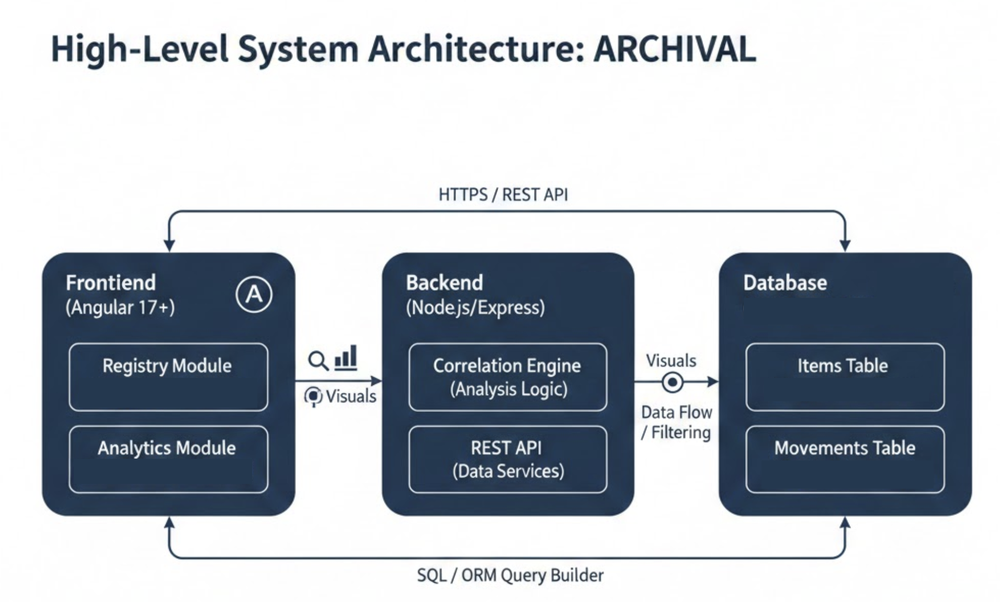

# 5. Software Requirements Specification: Archival

## 5.1 Requirements Introduction

### 5.1.1 Project Description
Archival is a specialized, full-stack curation platform engineered for design enthusiasts and intentional collectors who seek to move beyond simple inventory tracking toward a deep, analytical understanding of their personal belongings. By treating furniture, fashion, and literature as interconnected data points, the system allows users to document the "aesthetic DNA" of their home, linking physical objects to the historical design movements—such as Bauhaus, Mid-Century Modern, or Radical Design—that define them. The application utilizes an Angular-based "Museum View" to visualize the chronological density of a collection, leveraging a Node.js backend and a PostgreSQL relational database to identify the hidden common threads that unite disparate items into a cohesive personal archive. Through this sophisticated logic engine, users can analyze the historical evolution of their lifestyle and curate their environment with the rigor of a professional archivist.

The remainder of this document is structured as follows. Section 5.2 contains Functional Requirements describing the specific services and features provided by the system, such as polymorphic item registration and the style correlation engine. Section 5.3 contains Performance Requirements detailing the target metrics for interface responsiveness and complex SQL query execution. Section 5.4 details the Environment Requirements, specifying the hardware and software resources required for the development and execution of the application, including the Node.js runtime and PostgreSQL database.

### 5.1.2 UML Diagram

* **Frontend Layer (Angular 17+):** A responsive gallery interface using standalone components and Signals for high-performance state management.
* **Styling Layer (Tailwind CSS):** Implements a sharp-edged, high-contrast visual design inspired by modern museum archives.
* **Visualization Engine (D3.js or Chart.js):** Transforms database results into interactive "Density Maps" and "Style Correlation" charts.
* **Backend API (Node.js):** A RESTful service layer managing polymorphic data routing, historical logic, and SQL query execution.
* **Persistence Layer (PostgreSQL):** A relational SQL database designed to manage complex metadata associations between different item categories.
---

## 5.2 Functional Requirements

The completed Archival system will provide a comprehensive digital environment for design enthusiasts to curate, visualize, and analyze their personal collections. The system will allow users to register artifacts from diverse categories—including furniture, fashion, and literature—and link them to historical design movements. Users can expect a highly visual experience, featuring a digital "Museum View" gallery, an interactive chronological timeline of their possessions, and an automated analysis engine that identifies common aesthetic threads across different types of items.

### 5.2.1 Frontend CSC
The frontend provides the primary architectural interface for users to interact with Archival. It includes the specialized registration forms, the gallery grid for browsing artifacts, and the data visualization suite for historical analysis.

* **5.2.1.1** The Registry subsystem shall display a responsive grid of all archived artifacts.
* **5.2.1.2** The Registry subsystem shall provide a category-based filtering system.
    * The filtering criteria will include Decor, Fashion, Books, and Records.
* **5.2.1.3** The Registry subsystem shall provide a search bar to locate specific artifacts by title or creator.
* **5.2.1.4** The Registry subsystem shall provide a polymorphic entry form for adding new artifacts.
    * The form will dynamically update its input fields based on the selected item category.
* **5.2.1.5** The Entry form shall include metadata inputs for Books.
    * Specific fields will include ISBN, Publisher, and Author.
* **5.2.1.6** The Entry form shall include metadata inputs for Decor.
    * Specific fields will include Material, Manufacturer, and Original Designer.
* **5.2.1.7** The Entry form shall include metadata inputs for Fashion.
    * Specific fields will include Fabric, Brand, and Garment Type.
* **5.2.1.8** The Entry form shall include metadata inputs for Records.
    * Specific fields will include Record Label, Catalog Number, and Artist.
* **5.2.1.9** The Registry subsystem shall provide a dedicated visual documentation upload area.
    * The upload area will be styled with sharp-edged boundaries to maintain the museum aesthetic.
* **5.2.1.10** The Analytics subsystem shall display a "Temporal Intensity" bar graph.
    
    * The graph will visualize the frequency of items from the year 1920 to 2026.
* **5.2.1.11** The Analytics subsystem shall provide a "Journey" view.
    * The view will display artifacts as nodes on a continuous chronological path.
* **5.2.1.12** The Analytics subsystem shall display charts visualizing "Style Correlations."
    * The charts will show the percentage of the collection associated with specific design movements.

### 5.2.2 Backend CSC
The backend provides services for processing data, managing the relational database, and performing analytical calculations. It exposes REST APIs to enable secure communication with the Angular frontend.

* **5.2.2.1** The Database subsystem shall store artifact records with polymorphic attributes.
    
    * These attributes will be stored in a relational format with category-specific data contained in a JSONB structure.
* **5.2.2.2** The Database subsystem shall store a global list of Design Movements.
    * Movements will include, but are not limited to, Bauhaus, Mid-Century Modern, and Minimalism.
* **5.2.2.3** The Database subsystem shall maintain a relational link between each artifact and its assigned Design Movement.
* **5.2.2.4** The API subsystem shall provide endpoints for retrieving the full artifact collection.
* **5.2.2.5** The API subsystem shall provide endpoints for retrieving filtered subsets of the collection.
* **5.2.2.6** The API subsystem shall provide endpoints for submitting new artifact data.
* **5.2.2.7** The API subsystem shall provide endpoints for retrieving aggregated temporal data for the bar graph.
* **5.2.2.8** The API subsystem shall provide endpoints for retrieving style correlation percentages.

### 5.2.3 Hosting & Infrastructure CSC
The hosting and infrastructure subsystem ensures that the Archival application is deployable, stable, and accessible via the web.

* **5.2.3.1** The system shall host the unified Node.js and Angular application on a single cloud service provider.
* **5.2.3.2** The system shall host the PostgreSQL database using a managed relational database service.
* **5.2.3.3** The system shall utilize CI/CD pipelines to automatically redeploy the application upon code updates.

### 5.2.4 Error Handling CSC
The error handling subsystem ensures that failures such as invalid data entry or failed database queries are handled gracefully.

* **5.2.4.1** The system shall validate all user inputs on the frontend before submission.
* **5.2.4.2** The system shall display clear error messages for invalid inputs.
* **5.2.4.3** The system shall display user-friendly messages when the database connection or API requests fail.
    * Messages will avoid exposing internal system details or stack traces to the user.

### 5.2.5 Security & Privacy CSC
The security subsystem ensures the protection of user-curated data and ensures system integrity.

* **5.2.5.1** The system shall sanitize all user-submitted text to prevent script injection.
* **5.2.5.2** The system shall implement environment variables to protect sensitive configuration data like database credentials.

### 5.2.6 Accessibility CSC
The accessibility subsystem ensures the application is usable by individuals with varying visual needs.

* **5.2.6.1** The system shall maintain a high-contrast color palette of dark text on a light background.
* **5.2.6.2** The system shall provide alternative text descriptions for all primary UI action buttons.

### 5.2.7 Offline Mode CSC
The offline mode subsystem handles instances of lost connectivity using standard web practices.

* **5.2.7.1** The system shall display a "No Internet Connection" notification if the network becomes unavailable.
---

## 5.3 Performance Requirements

This section defines the performance standards for the Archival system. These requirements ensure that the high-fidelity visual interface remains responsive and that the underlying data processing maintains a standard of efficiency suitable for a professional digital archive.

### 5.3.1 Interface Transition Latency
5.3.1.1 The application shall complete the transition between different primary views within 200 milliseconds of a user-initiated navigation request.

This requirement ensures that moving between the Dashboard, Catalog, and Journey views feels instantaneous to the user. The 200ms limit includes the time required for the Angular router to initialize the new component and render the initial layout. It does not include the time required for asynchronous media assets, such as high-resolution photography, to finish loading, provided the UI structure is present.

### 5.3.2 Filter Execution Speed
5.3.2.1 The application shall update the filtered display of artifacts within 100 milliseconds of a change to the filter criteria.

As the user selects different design movements or categories, the catalog must update without perceived lag. This 100ms threshold is designed to ensure that the interface feels reactive. This speed is achieved through efficient client-side state management, where the filtering logic operates on the in-memory artifact stream before the DOM is updated.

### 5.3.3 Database Query Response Time
5.3.3.1 The backend system shall return the results of complex relational SQL queries within 150 milliseconds of receiving the request from the client.

This applies specifically to queries involving multiple joins between the artifact and movement tables. This requirement ensures that the Node.js API and PostgreSQL database are optimized for the polymorphic data structure. The 150ms limit refers to the time measured from the moment the request hits the API until the JSON payload is sent back to the client.

### 5.3.4 Visualization Frame Rate
5.3.4.1 The application shall maintain a consistent frame rate of 60 frames per second (fps) during all interactive transitions of the temporal intensity charts.

The D3.js or Chart.js visualizations must provide smooth animations during hover states or data updates. Maintaining 60fps prevents "stuttering" in the visual experience, which is critical for a boutique museum aesthetic. This requirement focuses on the rendering performance of the browser's SVG or Canvas elements when processing collection metadata.

### 5.3.5 Large Collection Capacity
5.3.5.1 The system shall maintain all performance requirements specified in sections 5.3.1 through 5.3.4 for collection sizes of up to 1,000 unique artifacts.

This requirement establishes the scalability of the application for serious collectors. The application must handle 1,000 entries with associated high-fidelity imagery and JSONB metadata without a degradation in scrolling smoothness or a significant increase in memory consumption.

---

## 5.4 Environment Requirements

This section details the hardware, software, and infrastructure resources necessary for the development, deployment, and execution of the Archival system.

### 5.4.1 Development Environment Requirements
The following resources are required for the construction, testing, and local maintenance of the application:

* **Workstation:** A standard computing system (macOS, Windows, or Linux) with a minimum of 8GB of RAM. This is required to support the concurrent execution of the Angular development server, the Node.js API runtime, and a local instance of PostgreSQL.
* **Integrated Development Environment (IDE):** Visual Studio Code (latest stable version). This will be used for writing the TypeScript and CSS code, utilizing extensions for Angular Language Service and Tailwind CSS IntelliSense to ensure code quality.
* **Version Control:** Git 2.x for source code management and collaborative tracking via a remote repository.
* **Node.js Runtime:** Node.js (Version 18.x or higher - LTS). This is essential to execute the backend logic and manage package dependencies for both the frontend and backend layers.
* **Database Management:** PostgreSQL 15+ installed locally. This allows for the development of the relational schema and the testing of complex polymorphic SQL queries before deployment.
* **Design Assets:** Access to Google Fonts for the **'Schibsted Grotesk'** typeface. This variable font is an unusual requirement but is justified as it provides the specific geometric, museum-quality aesthetic central to the "Archival" brand identity and professional gallery interface.

### 5.4.2 Deployment and Execution Environment Requirements
The following resources are required to host the completed system and allow end-users to interact with the application:

* **Unified Hosting Provider:** A cloud-based Platform-as-a-Service (PaaS) such as Render or Railway. 
    * **Justification:** These platforms allow for a "monolithic" deployment where a single Node.js instance serves the compiled Angular static files and the REST API simultaneously. This reduces complexity by avoiding Cross-Origin Resource Sharing (CORS) issues and simplifying the CI/CD pipeline.
* **Managed Database Service:** A hosted PostgreSQL service (e.g., Supabase or Render Postgres). 
    * **Justification:** This ensures that the user's personal archive is persisted in a secure, professionally managed environment with high availability.
* **Client Software:** A modern "evergreen" web browser (Chrome 90+, Safari 14+, or Firefox 88+). The browser must support the HTML5 Canvas and SVG APIs required by D3.js or Chart.js to render the temporal intensity visualizations.
* **Hardware Interface:** A computing device with a minimum screen resolution of 1024x768. This is a functional necessity to properly render the "Museum View" grid and the data-dense "Aesthetic Correlation" charts without visual clipping.
* **Network Connectivity:** An active internet connection (minimum 5 Mbps). This is required to fetch the Angular application bundle from the hosting server and to maintain real-time communication with the PostgreSQL database via the API.
* **Resource Acquisition:** All software tools (Angular, Node.js, PostgreSQL, Tailwind CSS) are open-source and currently available. The identified hosting services offer free-tier plans that are sufficient for the scope of this project; therefore, no further steps are required to acquire these resources.
